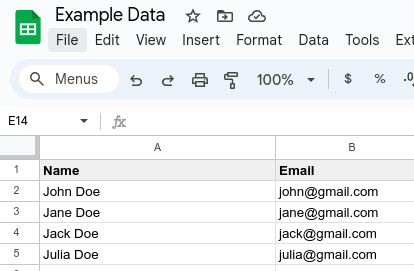
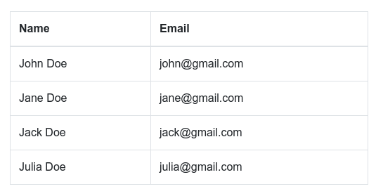
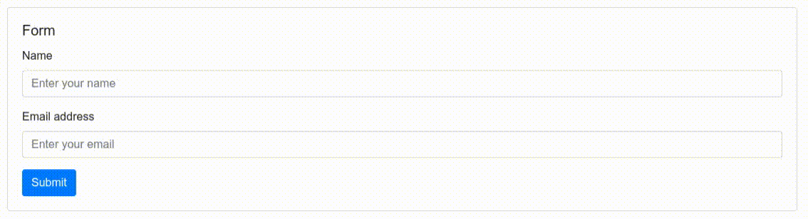
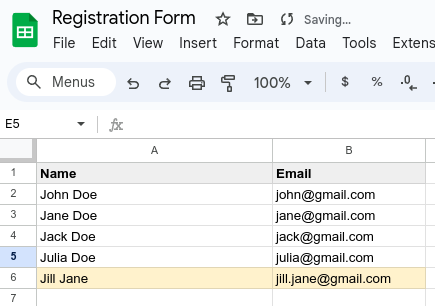

# Sheet API HTML

Sheet API HTML is an easy way to integrate your Sheet API with an HTML.

If you do not know Sheet API yet access it through https://sheetapi.rest to learn more!

It uses templates and HTML attributes to easily integrate an API with a HTML.
Its main use cases are:

- Displaying HTML data directly from a Sheet, with the possibility of updating it in real time
- Integrating forms, sending the submitted data directly into an Sheet

For the examples below we'll use the sheet that is contained in this links:
- Sheet API: https://api.sheetapi.rest/api/v1/sheet/g5e09XKtRZ4OaydVCSSeK
- Google Sheet: https://docs.google.com/spreadsheets/d/1wNR-5VUKN6G6voJC1jwHqbt2mkmzxyDUMnkzHIppMpg/edit#gid=0

# Usage

Apply the snippet below to the pages you would like to connect with Sheet API

```html
<script src="https://unpkg.com/@sheet-api/html"></script>
```

## Displaying HTML from a Sheet

You should add the attribute `data-sheet-api-url` to the HTML tag that you would like to connect with a sheet.

For example:

```html
<div class="container">
  <table class="table table-bordered">
    <thead>
      <tr>
        <th>Name</th>
        <th>Email</th>
      </tr>
    </thead>
    <tbody
      data-sheet-api-url="https://api.sheetapi.rest/api/v1/sheet/g5e09XKtRZ4OaydVCSSeK"
    >
      <tr>
        <td>{{ Name }}</td>
        <td>{{ Email }}</td>
      </tr>
    </tbody>
  </table>
</div>
```

This will automatically generate a table for you and fill it with the data from the sheet.

If you had for example the following data in your Sheet:



You would have the following HTML form:



If you wish to update your data each `60` seconds for example, you can also add
the attribute: `data-refresh-time="60"` and your data will be refreshed each 60
seconds

## Receiving Form data into the Sheet

To receive data from a form into your sheet:

- Add the attribute `data-sheet-api-url` to a `<form>` element
- Add the attributes `name=<Column>` to the `<input>` elements of your form

Sheet API will automatically keep track of them and send them to the designated
columns when the form is submitted

You can also optionally:

- Add the attribute `data-loading-msg=<loading message>` to your form
    - This will automatically add a loading message to your submit button
- Add the attribute `data-success-msg=<success message>` to your form
- Add an element with the class `class="sheet-api-success-container"`
    - This will automatically set up a success message to your form
- Add the attribute `data-error-msg=<error message>` to your form
- Add an element with the class `class="sheet-api-error-container"`
    - This will automatically set up a error message to your form in case the submission failed

An example of a HTML form is the one below:

```html
<div class="card">
  <div class="card-body">
    <h5 class="card-title">Form</h5>
    <form
      data-sheet-api-url="https://api.sheetapi.rest/api/v1/sheet/g5e09XKtRZ4OaydVCSSeK"
      data-loading-msg="Loading..."
      data-success-msg="Thank you! We have received your registration"
      data-error-msg="Your submission failed, please try again later"
    >
      <div class="mb-3">
        <label for="name" class="form-label">Name</label>
        <input type="text" class="form-control" name="Name" placeholder="Enter your name" required />
      </div>
      <div class="mb-3">
        <label for="email" class="form-label">Email address</label>
        <input type="email" class="form-control" name="Email" placeholder="Enter your email" required />
      </div>
      <button type="submit" class="btn btn-primary">Submit</button>
      <span class="sheet-api-success-container"></span>
      <span class="sheet-api-error-container"></span>
    </form>
  </div>
</div>
```

The form can be submitted like in the video below:



After some seconds, the user will appear in the Sheet like in the image below
(the new user being highlighted in yellow)


